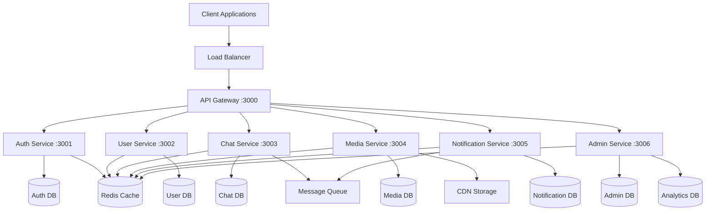
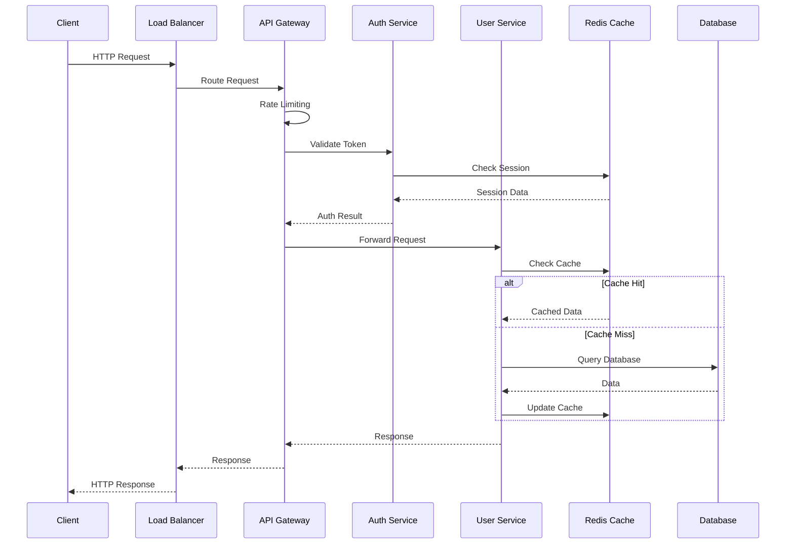
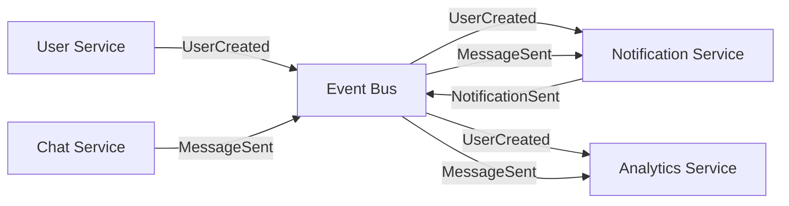
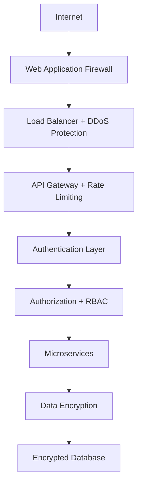
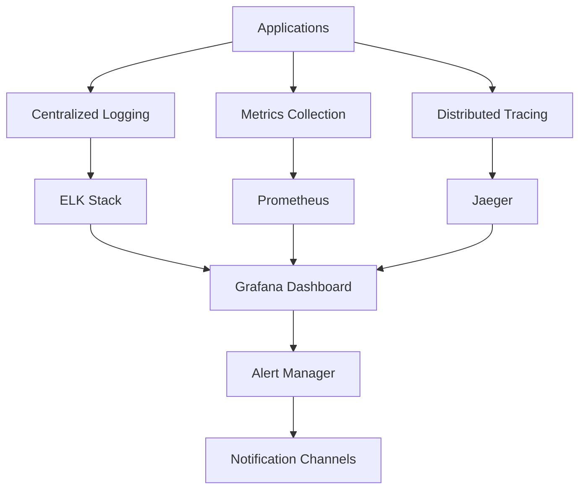

# 🏗️ EndlessChatt Architecture Documentation

**Enterprise Social Media Platform - Technical Architecture**

_Created by: Deepansh Gangwar_

---

## 📋 Table of Contents

- [🎯 Architecture Overview](#-architecture-overview)
- [🏗️ System Design](#️-system-design)
- [📁 Project Structure](#-project-structure)
- [🔄 Data Flow](#-data-flow)
- [🔗 Service Communication](#-service-communication)
- [💾 Database Design](#-database-design)
- [🔒 Security Architecture](#-security-architecture)
- [📊 Monitoring & Observability](#-monitoring--observability)
- [🚀 Deployment Architecture](#-deployment-architecture)

---

## 🎯 Architecture Overview

### Design Philosophy

EndlessChatt follows **microservices architecture** principles with emphasis on:

- **Scalability**: Independent service scaling
- **Reliability**: Fault tolerance and graceful degradation
- **Maintainability**: Clean code and separation of concerns
- **Security**: Defense in depth strategy
- **Performance**: Optimized for high-throughput operations

### Architecture Patterns

| Pattern           | Implementation           | Purpose                       |
| ----------------- | ------------------------ | ----------------------------- |
| **Microservices** | Independent services     | Scalability & maintainability |
| **API Gateway**   | Single entry point       | Request routing & security    |
| **Event-Driven**  | Async messaging          | Loose coupling                |
| **CQRS**          | Command/Query separation | Performance optimization      |
| **Repository**    | Data access abstraction  | Testability                   |
| **Middleware**    | Cross-cutting concerns   | Reusability                   |

---

## 🏗️ System Design

### High-Level Architecture



### Service Responsibilities

| Service                  | Port | Responsibilities                                  |
| ------------------------ | ---- | ------------------------------------------------- |
| **API Gateway**          | 3000 | Request routing, authentication, rate limiting    |
| **Auth Service**         | 3001 | Authentication, authorization, session management |
| **User Service**         | 3002 | User profiles, relationships, preferences         |
| **Chat Service**         | 3003 | Real-time messaging, chat rooms, message history  |
| **Media Service**        | 3004 | File uploads, image processing, CDN management    |
| **Notification Service** | 3005 | Push notifications, email, SMS, in-app alerts     |
| **Admin Service**        | 3006 | Analytics, moderation, system management          |

---

## 📁 Project Structure

### Monorepo Organization

```
social-media-blog-app/
├── 📁 src/                     # Source code
│   ├── 📄 server.js             # Server entry point
│   ├── 📄 app.js                # Main Express application
│   ├── 📁 config/               # Configuration management
│   │   ├── 📄 index.js
│   │   └── 📁 database/
│   │       └── 📄 connection.js # MongoDB connection setup
│   ├── 📁 modules/              # Feature modules
│   │   ├── 📁 admin/            # Admin module
│   │   │   ├── 📁 controllers/
│   │   │   │   └── 📄 admin.controller.js
│   │   │   ├── 📁 services/
│   │   │   │   ├── 📄 analytics.service.js
│   │   │   │   ├── 📄 audit.service.js
│   │   │   │   ├── 📄 cache.service.js
│   │   │   │   ├── 📄 exportImport.service.js
│   │   │   │   ├── 📄 notification.service.js
│   │   │   │   ├── 📄 queryBuilder.service.js
│   │   │   │   ├── 📄 security.service.js
│   │   │   │   └── 📄 validation.service.js
│   │   │   └── 📁 routes/
│   │   │       └── 📄 admin.routes.js
│   │   ├── 📁 auth/             # Authentication module
│   │   │   ├── 📁 controllers/
│   │   │   │   ├── 📄 forgotPassword.controller.js
│   │   │   │   └── 📄 resetPassword.controller.js
│   │   │   ├── 📁 routes/
│   │   │   │   ├── 📄 forgotPassword.routes.js
│   │   │   │   └── 📄 resetPassword.routes.js
│   │   │   └── 📄 index.js
│   │   ├── 📁 users/            # Users module
│   │   │   ├── 📁 controllers/
│   │   │   │   └── 📄 user.controller.js
│   │   │   ├── 📁 models/
│   │   │   │   └── 📄 user.model.js
│   │   │   ├── 📁 middleware/
│   │   │   │   ├── 📄 search.middleware.js
│   │   │   │   └── 📄 user.validation.js
│   │   │   ├── 📁 routes/
│   │   │   │   └── 📄 user.routes.js
│   │   │   └── 📄 index.js
│   │   ├── 📁 blogs/            # Blog post module
│   │   │   ├── 📁 controllers/
│   │   │   │   └── 📄 blog.controller.js
│   │   │   ├── 📁 models/
│   │   │   │   └── 📄 blog.model.js
│   │   │   ├── 📁 routes/
│   │   │   │   └── 📄 blog.routes.js
│   │   │   └── 📄 index.js
│   │   └── 📁 email/            # Email and notifications module
│   │       ├── 📁 services/
│   │       │   └── 📄 email.service.js
│   │       ├── 📁 templates/
│   │       │   └── 📄 email.templates.js
│   │       ├── 📁 utils/
│   │       │   └── 📄 sendEmail.js
│   │       ├── 📁 views/emails/
│   │       │   ├── 📄 forgot-password.ejs
│   │       │   └── 📄 password-reset-success.ejs
│   │       └── 📄 index.js
│   └── 📁 shared/               # Shared utilities and middlewares
│       ├── 📁 constants/
│       │   └── 📄 app.constants.js
│       ├── 📁 middleware/
│       │   ├── 📄 auth.middleware.js
│       │   ├── 📄 isAdmin.middleware.js
│       │   ├── 📄 multer.middleware.js
│       │   ├── 📄 rateLimit.middleware.js
│       │   ├── 📄 rbac.middleware.js
│       │   └── 📄 validate.middleware.js
│       ├── 📁 utils/
│       │   ├── 📄 ApiError.js
│       │   ├── 📄 ApiResponse.js
│       │   ├── 📄 AsyncHandler.js
│       │   └── 📄 cookieOptions.js
│       ├── 📁 validators/
│       │   ├── 📄 search.validator.js
│       │   └── 📄 zod.validator.js
│       └── 📄 index.js
├── 📁 public/                   # Static assets (lowercase standard)
│   ├── 📁 temp/
│   │   └── 📄 .gitkeep
│   └── 📁 favicon-logo/
│       ├── 📄 logo.png
│       └── 📄 logo.svg
├── 📁 docs/                     # Project documentation
│   ├── 📄 admin.control.md
│   └── 📁 postman/
│       └── 📄 social-blog-api.postman_collection.json
├── 📄 LICENSE
├── 📄 README.md
├── 📄 ROUTES_DOCUMENTATION.md    # Route-by-route documentation
├── 📄 package.json
├── 📄 package-lock.json
├── 📄 .env.example
├── 📄 .gitignore
├── 📄 .prettierignore
├── 📄 .prettierrc
├── 📄 eslint.config.js

```

---

## 🔄 Data Flow

### Request Flow Architecture



### Event-Driven Communication



---

## 🔗 Service Communication

### Communication Patterns

| Pattern          | Use Case             | Implementation |
| ---------------- | -------------------- | -------------- |
| **Synchronous**  | Real-time operations | HTTP/REST APIs |
| **Asynchronous** | Background tasks     | Message queues |
| **Event-Driven** | State changes        | Event bus      |
| **Streaming**    | Real-time data       | WebSockets     |

### API Standards

```javascript
// Standard API Response Format
{
  "statusCode": 200,
  "success": true,
  "message": "Operation successful",
  "data": {
    // Response payload
  },
  "meta": {
    "timestamp": "2024-01-15T10:30:00Z",
    "requestId": "req_123456789",
    "version": "v2.0.0"
  },
  "pagination": {
    "page": 1,
    "limit": 20,
    "total": 100,
    "totalPages": 5
  }
}
```

---

## 💾 Database Design

### Database Strategy

| Service          | Database   | Purpose                    | Scaling Strategy        |
| ---------------- | ---------- | -------------------------- | ----------------------- |
| **Auth**         | MongoDB    | User credentials, sessions | Read replicas           |
| **User**         | MongoDB    | Profiles, relationships    | Sharding by user_id     |
| **Chat**         | MongoDB    | Messages, rooms            | Sharding by room_id     |
| **Media**        | MongoDB    | File metadata              | CDN + metadata          |
| **Notification** | MongoDB    | Notification history       | Time-based partitioning |
| **Analytics**    | ClickHouse | Events, metrics            | Columnar storage        |
| **Cache**        | Redis      | Session, temporary data    | Clustering              |

### Data Models

#### User Model

```javascript
{
  _id: ObjectId,
  username: String,
  email: String,
  profile: {
    firstName: String,
    lastName: String,
    avatar: String,
    bio: String,
    location: String
  },
  settings: {
    privacy: Object,
    notifications: Object,
    theme: String
  },
  metadata: {
    createdAt: Date,
    updatedAt: Date,
    lastActive: Date,
    isVerified: Boolean,
    status: String
  }
}
```

#### Message Model

```javascript
{
  _id: ObjectId,
  roomId: ObjectId,
  senderId: ObjectId,
  content: {
    text: String,
    type: String, // text, image, file, etc.
    metadata: Object
  },
  reactions: [{
    userId: ObjectId,
    emoji: String,
    timestamp: Date
  }],
  thread: {
    parentId: ObjectId,
    replyCount: Number
  },
  timestamps: {
    sent: Date,
    delivered: Date,
    read: Date
  },
  status: String // sent, delivered, read, deleted
}
```

---

## 🔒 Security Architecture

### Security Layers



### Security Features

| Layer              | Implementation       | Purpose               |
| ------------------ | -------------------- | --------------------- |
| **Network**        | WAF, DDoS protection | Traffic filtering     |
| **API Gateway**    | Rate limiting, CORS  | Request control       |
| **Authentication** | JWT, OAuth2, MFA     | Identity verification |
| **Authorization**  | RBAC, permissions    | Access control        |
| **Data**           | AES-256, bcrypt      | Data protection       |
| **Transport**      | TLS 1.3, HTTPS       | Secure communication  |
| **Monitoring**     | Audit logs, SIEM     | Threat detection      |

---

## 📊 Monitoring & Observability

### Observability Stack



### Key Metrics

| Category           | Metrics                               | Tools               |
| ------------------ | ------------------------------------- | ------------------- |
| **Application**    | Response time, error rate, throughput | Prometheus, Grafana |
| **Infrastructure** | CPU, memory, disk, network            | Node Exporter       |
| **Database**       | Query performance, connections        | MongoDB Exporter    |
| **Business**       | User engagement, feature usage        | Custom metrics      |

---

## 🚀 Deployment Architecture

### Environment Strategy

| Environment     | Purpose                | Configuration           |
| --------------- | ---------------------- | ----------------------- |
| **Development** | Local development      | Docker Compose          |
| **Testing**     | Automated testing      | Kubernetes (minikube)   |
| **Staging**     | Pre-production testing | Kubernetes cluster      |
| **Production**  | Live system            | Multi-region Kubernetes |

### Deployment Pipeline

```mermaid
graph LR
    Code[Code Commit] --> Build[Build & Test]
    Build --> Security[Security Scan]
    Security --> Package[Container Build]
    Package --> Registry[Container Registry]
    Registry --> Deploy[Deploy to Staging]
    Deploy --> Test[Integration Tests]
    Test --> Approve[Manual Approval]
    Approve --> Prod[Production Deployment]
    Prod --> Monitor[Monitoring & Alerts]
```



---

## 🔧 Configuration Management

### Environment Variables

```bash
# Application Configuration
NODE_ENV=production
PORT=3000
API_VERSION=v2

# Database Configuration
MONGODB_URI=mongodb://cluster.mongodb.net/endlesschatt
REDIS_URL=redis://redis-cluster:6379

# Security Configuration
JWT_SECRET=your-super-secret-key
JWT_REFRESH_SECRET=your-refresh-secret
ENCRYPTION_KEY=your-encryption-key

# External Services
CLOUDINARY_CLOUD_NAME=your-cloud-name
SENDGRID_API_KEY=your-sendgrid-key
TWILIO_ACCOUNT_SID=your-twilio-sid

# Monitoring
SENTRY_DSN=your-sentry-dsn
NEW_RELIC_LICENSE_KEY=your-newrelic-key
```

---

## 📈 Scalability Considerations

### Horizontal Scaling

- **Stateless Services**: All services designed to be stateless
- **Load Balancing**: Round-robin and least-connections algorithms
- **Auto-scaling**: Kubernetes HPA based on CPU/memory metrics
- **Database Sharding**: Horizontal partitioning for large datasets

### Performance Optimization

- **Caching Strategy**: Multi-level caching (Redis, CDN, browser)
- **Database Optimization**: Indexing, query optimization, connection pooling
- **CDN Integration**: Global content delivery for static assets
- **Compression**: Gzip compression for API responses

---

**Architecture designed for scale, built for reliability.**

_EndlessChatt - Connecting the world, one conversation at a time._
