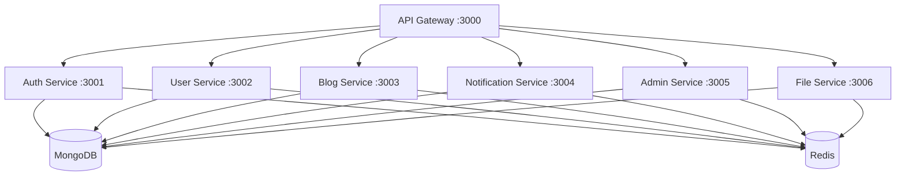

# 🏢 Enterprise Social Media Blog Platform

<div align="center">


**Production-ready microservices platform for social media blogging with enterprise-grade security, analytics, and
scalability**

[🚀 Quick Start](#-quick-start) • [🏗️ Architecture](#-microservice-architecture) • [📚 Documentation](#-documentation) •
[🔧 Development](#-development-setup) • [🐳 Deployment](#-deployment)

</div>

---

## 📋 Table of Contents

- [🎯 Overview](#-overview)
- [✨ Features](#-features)
- [🏗️ Microservice Architecture](#-microservice-architecture)
- [🚀 Quick Start](#-quick-start)
- [🔧 Development Setup](#-development-setup)
- [🐳 Deployment](#-deployment)
- [📚 Documentation](#-documentation)
- [🧪 Testing](#-testing)
- [🔒 Security](#-security)
- [📊 Monitoring](#-monitoring)
- [🤝 Contributing](#-contributing)
- [📄 License](#-license)

---

## 🎯 Overview

### What is this?

A **modern, scalable social media blog platform** built with microservices architecture, designed for enterprise-level
applications. Features include user management, content creation, real-time notifications, advanced analytics, and
comprehensive admin controls.

### Key Highlights

- 🏗️ **Microservices Architecture** - Independent, scalable services
- 🔒 **Enterprise Security** - JWT, RBAC, rate limiting, audit logging
- 📊 **Advanced Analytics** - Real-time metrics and business intelligence
- ⚡ **High Performance** - Redis caching, optimized queries, CDN ready
- 🔄 **Event-Driven** - Async communication between services
- 🐳 **Container Ready** - Docker & Kubernetes deployment
- 📱 **API First** - RESTful APIs with comprehensive documentation
- 🧪 **Test Coverage** - Unit, integration, and E2E testing

### Tech Stack

| Category           | Technologies                |
| ------------------ | --------------------------- |
| **Runtime**        | Node.js 20+, ES6+ Modules   |
| **Framework**      | Express.js, RESTful APIs    |
| **Database**       | MongoDB 8.0+, Mongoose ODM  |
| **Cache**          | Redis 7.0+, IORedis         |
| **Authentication** | JWT, bcrypt, Passport.js    |
| **Validation**     | Joi, Zod schemas            |
| **File Upload**    | Multer, Cloudinary          |
| **Email**          | Nodemailer, EJS templates   |
| **Queue**          | BullMQ, Redis               |
| **Monitoring**     | Winston, Morgan, Sentry     |
| **Testing**        | Jest, Supertest             |
| **DevOps**         | Docker, Docker Compose, PM2 |
| **Code Quality**   | ESLint, Prettier, Husky     |

---

## ✨ Features

### 🔐 Authentication & Authorization

- JWT-based authentication with refresh tokens
- Role-based access control (RBAC)
- Multi-factor authentication (MFA)
- Password reset with email verification
- Session management with Redis
- Account lockout and security policies

### 👥 User Management

- User registration and profile management
- Avatar upload with image optimization
- User preferences and settings
- Activity tracking and audit logs
- Social features (follow/unfollow)
- User analytics and insights

### 📝 Content Management

- Rich text blog creation and editing
- Media upload (images, videos)
- Content moderation and approval workflow
- Categories and tags system
- SEO optimization features
- Content scheduling and publishing

### 🔔 Notification System

- Real-time in-app notifications
- Email notifications with templates
- SMS notifications (optional)
- Push notifications (web/mobile)
- Notification preferences
- Bulk notification management

### 👑 Admin Dashboard

- Comprehensive analytics dashboard
- User management and moderation
- Content management and moderation
- System monitoring and health checks
- Security monitoring and threat detection
- Bulk operations and data export

### 📊 Analytics & Reporting

- Real-time user analytics
- Content performance metrics
- System performance monitoring
- Custom reports and dashboards
- Data export (CSV, JSON, PDF)
- Business intelligence insights

---

## 🏗️ Microservice Architecture

### Service Overview



### Service Structure

```
social-media-blog-app/
├── 🌐 gateway/                      # API Gateway (Port: 3000)
│   ├── src/
│   │   ├── controllers/
│   │   ├── middleware/
│   │   ├── routes/
│   │   ├── services/
│   │   └── utils/
│   ├── Dockerfile
│   └── package.json
│
├── 🚀 services/                     # Microservices
│   ├── 🔐 auth-service/            # Authentication (Port: 3001)
│   │   ├── src/
│   │   │   ├── controllers/
│   │   │   │   ├── auth.controller.js
│   │   │   │   ├── password.controller.js
│   │   │   │   └── session.controller.js
│   │   │   ├── services/
│   │   │   │   ├── auth.service.js
│   │   │   │   ├── jwt.service.js
│   │   │   │   └── password.service.js
│   │   │   ├── models/
│   │   │   │   ├── user.model.js
│   │   │   │   └── session.model.js
│   │   │   ├── routes/
│   │   │   ├── middleware/
│   │   │   ├── validators/
│   │   │   └── utils/
│   │   ├── tests/
│   │   ├── Dockerfile
│   │   └── package.json
│   │
│   ├── 👤 user-service/            # User Management (Port: 3002)
│   ├── 📝 blog-service/            # Content Management (Port: 3003)
│   ├── 🔔 notification-service/    # Notifications (Port: 3004)
│   ├── 👑 admin-service/           # Admin & Analytics (Port: 3005)
│   └── 📁 file-service/            # File Upload (Port: 3006)
│
├── 🔗 shared/                      # Shared Libraries
│   ├── lib/
│   │   ├── constants/
│   │   │   ├── http-status.constant.js
│   │   │   ├── error-codes.constant.js
│   │   │   └── app.constant.js
│   │   ├── utils/
│   │   │   ├── api-response.util.js
│   │   │   ├── api-error.util.js
│   │   │   ├── async-handler.util.js
│   │   │   └── logger.util.js
│   │   ├── middleware/
│   │   │   ├── error-handler.middleware.js
│   │   │   ├── auth.middleware.js
│   │   │   └── validation.middleware.js
│   │   ├── database/
│   │   │   ├── mongodb.config.js
│   │   │   └── redis.config.js
│   │   └── services/
│   │       ├── cache.service.js
│   │       └── queue.service.js
│   └── package.json
│
├── 🏗️ infrastructure/              # Infrastructure as Code
│   ├── docker/
│   │   ├── docker-compose.yml
│   │   ├── docker-compose.prod.yml
│   │   └── docker-compose.dev.yml
│   ├── kubernetes/
│   │   ├── deployments/
│   │   ├── services/
│   │   └── ingress/
│   └── monitoring/
│       ├── prometheus/
│       └── grafana/
│
├── 🧪 tests/                       # Global Tests
│   ├── integration/
│   ├── e2e/
│   └── performance/
│
├── 📚 docs/                        # Documentation
│   ├── api/
│   ├── architecture/
│   ├── deployment/
│   └── postman/
│
├── 🔧 scripts/                     # Build & Deployment Scripts
│   ├── build.sh
│   ├── deploy.sh
│   └── setup.sh
│
├── 📦 package.json                 # Root package.json
├── 🐳 docker-compose.yml          # Main docker compose
├── 📚 README.md                    # This file
└── 🔧 .env.example                # Environment template
```

### Service Communication

- **Synchronous**: REST APIs via API Gateway
- **Asynchronous**: Event-driven messaging with Redis/BullMQ
- **Data Consistency**: Event sourcing and SAGA pattern
- **Service Discovery**: Docker networking and health checks

---

## 🚀 Quick Start

### Prerequisites

- **Node.js** 20+ ([Download](https://nodejs.org/))
- **MongoDB** 8.0+ ([Download](https://www.mongodb.com/try/download/community))
- **Redis** 7.0+ ([Download](https://redis.io/download))
- **Docker** 20+ ([Download](https://www.docker.com/get-started))
- **Git** ([Download](https://git-scm.com/downloads))

### Installation

```bash
# 1. Clone repository
git clone https://github.com/mr-deepansh/social-media-blog-app.git
cd social-media-blog-app

# 2. Install dependencies
npm install

# 3. Setup environment
cp .env.example .env
# Edit .env with your configuration

# 4. Start with Docker (Recommended)
docker-compose up -d

# 5. Verify installation
curl http://localhost:3000/health
```

### Manual Setup (Without Docker)

```bash
# 1. Start MongoDB and Redis
# MongoDB: mongod --dbpath /data/db
# Redis: redis-server

# 2. Install shared dependencies
cd shared && npm install && cd ..

# 3. Start services
npm run dev:gateway    # Port 3000
npm run dev:auth       # Port 3001
npm run dev:user       # Port 3002
npm run dev:blog       # Port 3003
npm run dev:notification # Port 3004
npm run dev:admin      # Port 3005
npm run dev:file       # Port 3006
```

### Verification

```bash
# Check all services
curl http://localhost:3000/health

# Test API
curl http://localhost:3000/api/v2

# View logs
docker-compose logs -f
```

---

## 🔧 Development Setup

### Environment Configuration

```bash
# Copy environment template
cp .env.example .env

# Required environment variables
NODE_ENV=development
PORT=3000
MONGODB_URI=mongodb://localhost:27017/social_media_blog
REDIS_URL=redis://localhost:6379
JWT_SECRET=your-super-secret-jwt-key
JWT_REFRESH_SECRET=your-refresh-secret-key
EMAIL_HOST=smtp.gmail.com
EMAIL_USER=your-email@gmail.com
EMAIL_PASS=your-app-password
CLOUDINARY_CLOUD_NAME=your-cloud-name
CLOUDINARY_API_KEY=your-api-key
CLOUDINARY_API_SECRET=your-api-secret
```

### Development Scripts

```bash
# Development
npm run dev              # Start all services in development
npm run dev:gateway      # Start API Gateway only
npm run dev:auth         # Start Auth Service only

# Building
npm run build            # Build all services
npm run build:gateway    # Build specific service

# Testing
npm test                 # Run all tests
npm run test:unit        # Unit tests only
npm run test:integration # Integration tests
npm run test:e2e         # End-to-end tests
npm run test:coverage    # Test coverage report

# Code Quality
npm run lint             # ESLint check
npm run lint:fix         # Fix ESLint issues
npm run format           # Prettier formatting
npm run format:check     # Check formatting

# Database
npm run db:seed          # Seed database with sample data
npm run db:migrate       # Run database migrations
npm run db:reset         # Reset database

# Docker
npm run docker:build     # Build Docker images
npm run docker:up        # Start with Docker Compose
npm run docker:down      # Stop Docker containers
```

### Code Style & Standards

- **ESLint**: Airbnb configuration with custom rules
- **Prettier**: Consistent code formatting
- **Husky**: Pre-commit hooks for quality checks
- **Conventional Commits**: Standardized commit messages
- **JSDoc**: Comprehensive code documentation

### File Naming Conventions

```
# Controllers
user.controller.js
blog.controller.js

# Services
user.service.js
email.service.js

# Models
user.model.js
blog.model.js

# Routes
user.routes.js
auth.routes.js

# Middleware
auth.middleware.js
validation.middleware.js

# Utilities
api-response.util.js
logger.util.js

# Constants
http-status.constant.js
app.constant.js

# Validators
user.validator.js
blog.validator.js
```

---

## 🐳 Deployment

### Docker Deployment

```bash
# Development
docker-compose -f docker-compose.dev.yml up -d

# Production
docker-compose -f docker-compose.prod.yml up -d

# Scaling services
docker-compose up -d --scale user-service=3 --scale blog-service=2
```

### Kubernetes Deployment

```bash
# Apply configurations
kubectl apply -f infrastructure/kubernetes/

# Check deployment status
kubectl get pods
kubectl get services

# View logs
kubectl logs -f deployment/auth-service
```

### Production Checklist

- [ ] Environment variables configured
- [ ] SSL certificates installed
- [ ] Database backups scheduled
- [ ] Monitoring and alerting setup
- [ ] Load balancer configured
- [ ] CDN setup for static assets
- [ ] Security headers configured
- [ ] Rate limiting enabled
- [ ] Logging and error tracking
- [ ] Health checks implemented

---

## 📚 Documentation

### API Documentation

- **Postman Collection**: [Import Collection](docs/postman/)
- **OpenAPI Spec**: [View Swagger](docs/api/swagger.yml)
- **API Reference**: [docs/api/](docs/api/)

### Architecture Documentation

- **System Design**: [docs/architecture/system-design.md](docs/architecture/system-design.md)
- **Database Schema**: [docs/architecture/database-schema.md](docs/architecture/database-schema.md)
- **Service Communication**: [docs/architecture/service-communication.md](docs/architecture/service-communication.md)

### Deployment Documentation

- **Docker Setup**: [docs/deployment/docker.md](docs/deployment/docker.md)
- **Kubernetes Guide**: [docs/deployment/kubernetes.md](docs/deployment/kubernetes.md)
- **Production Setup**: [docs/deployment/production.md](docs/deployment/production.md)

### Additional Resources

- **Contributing Guide**: [CONTRIBUTING.md](CONTRIBUTING.md)
- **Code of Conduct**: [CODE_OF_CONDUCT.md](CODE_OF_CONDUCT.md)
- **Security Policy**: [SECURITY.md](SECURITY.md)
- **Changelog**: [CHANGELOG.md](CHANGELOG.md)

---

## 🧪 Testing

### Test Structure

```
tests/
├── unit/                    # Unit tests
│   ├── services/
│   ├── controllers/
│   └── utils/
├── integration/             # Integration tests
│   ├── auth/
│   ├── user/
│   └── blog/
├── e2e/                     # End-to-end tests
│   ├── user-journey/
│   └── admin-workflow/
├── performance/             # Performance tests
│   ├── load-testing/
│   └── stress-testing/
└── fixtures/                # Test data
    ├── users.json
    └── blogs.json
```

### Running Tests

```bash
# All tests
npm test

# Specific test suites
npm run test:unit
npm run test:integration
npm run test:e2e

# Coverage report
npm run test:coverage

# Watch mode
npm run test:watch

# Performance tests
npm run test:performance
```

### Test Configuration

- **Framework**: Jest
- **Assertions**: Jest matchers + custom matchers
- **Mocking**: Jest mocks + MongoDB Memory Server
- **Coverage**: Istanbul/NYC
- **E2E**: Supertest + Puppeteer

---

## 🔒 Security

### Security Features

- **Authentication**: JWT with refresh tokens
- **Authorization**: Role-based access control (RBAC)
- **Input Validation**: Joi/Zod schema validation
- **Rate Limiting**: Express rate limit with Redis
- **CORS**: Configurable cross-origin resource sharing
- **Helmet**: Security headers middleware
- **Data Encryption**: bcrypt for passwords, AES for sensitive data
- **SQL Injection**: MongoDB injection prevention
- **XSS Protection**: Input sanitization and CSP headers
- **CSRF Protection**: CSRF tokens for state-changing operations

### Security Best Practices

- Regular security audits with `npm audit`
- Dependency vulnerability scanning
- Environment variable validation
- Secure session management
- Audit logging for sensitive operations
- IP whitelisting for admin operations
- File upload restrictions and scanning

### Reporting Security Issues

Please report security vulnerabilities to [deepanshgangwar7037@outlook.com](mailto:deepanshgangwar7037@outlook.com)

---

## 📊 Monitoring

### Application Monitoring

- **Health Checks**: `/health` endpoint for each service
- **Metrics**: Prometheus metrics collection
- **Logging**: Structured logging with Winston
- **Error Tracking**: Sentry integration
- **Performance**: APM with response time tracking

### Infrastructure Monitoring

- **System Metrics**: CPU, Memory, Disk usage
- **Database Monitoring**: MongoDB performance metrics
- **Cache Monitoring**: Redis performance and hit rates
- **Network Monitoring**: Request/response metrics

### Alerting

- **Error Rate**: Alert on high error rates
- **Response Time**: Alert on slow responses
- **Resource Usage**: Alert on high resource consumption
- **Service Health**: Alert on service failures

---

## 🤝 Contributing

### Development Workflow

1. **Fork** the repository
2. **Create** a feature branch: `git checkout -b feature/amazing-feature`
3. **Follow** coding standards and conventions
4. **Write** tests for new functionality
5. **Commit** changes: `git commit -m 'feat: add amazing feature'`
6. **Push** to branch: `git push origin feature/amazing-feature`
7. **Submit** a Pull Request

### Code Standards

- Follow ESLint configuration
- Write meaningful commit messages
- Add JSDoc comments for functions
- Maintain test coverage above 80%
- Update documentation for new features

### Pull Request Guidelines

- Provide clear description of changes
- Include relevant issue numbers
- Ensure all tests pass
- Update documentation if needed
- Request review from maintainers

---

## 📄 License

**MIT License**

Copyright (c) 2024 Deepansh Gangwar

Permission is hereby granted, free of charge, to any person obtaining a copy of this software and associated
documentation files (the "Software"), to deal in the Software without restriction, including without limitation the
rights to use, copy, modify, merge, publish, distribute, sublicense, and/or sell copies of the Software, and to permit
persons to whom the Software is furnished to do so, subject to the following conditions:

The above copyright notice and this permission notice shall be included in all copies or substantial portions of the
Software.

THE SOFTWARE IS PROVIDED "AS IS", WITHOUT WARRANTY OF ANY KIND, EXPRESS OR IMPLIED, INCLUDING BUT NOT LIMITED TO THE
WARRANTIES OF MERCHANTABILITY, FITNESS FOR A PARTICULAR PURPOSE AND NONINFRINGEMENT. IN NO EVENT SHALL THE AUTHORS OR
COPYRIGHT HOLDERS BE LIABLE FOR ANY CLAIM, DAMAGES OR OTHER LIABILITY, WHETHER IN AN ACTION OF CONTRACT, TORT OR
OTHERWISE, ARISING FROM, OUT OF OR IN CONNECTION WITH THE SOFTWARE OR THE USE OR OTHER DEALINGS IN THE SOFTWARE.

---

## 📞 Support & Contact

### 🎯 Support Channels

- **📧 Email**: [deepanshgangwar7037@outlook.com](mailto:deepanshgangwar7037@outlook.com)
- **💼 LinkedIn**: [Deepansh Gangwar](https://linkedin.com/in/deepansh-gangwar)
- **🐛 Issues**: [GitHub Issues](https://github.com/mr-deepansh/social-media-blog-app/issues)
- **💬 Discussions**: [GitHub Discussions](https://github.com/mr-deepansh/social-media-blog-app/discussions)

### 🌟 Show Your Support

If this project helps you, please consider:

- ⭐ **Starring** the repository
- 🐛 **Reporting** bugs and issues
- 💡 **Suggesting** new features
- 🤝 **Contributing** to the codebase
- 📢 **Sharing** with others

---

<div align="center">

**🚀 Built with ❤️ by [Deepansh Gangwar](https://github.com/mr-deepansh)**

[](https://github.com/mr-deepansh)
[](https://linkedin.com/in/deepansh-gangwar)
[](mailto:deepanshgangwar7037@outlook.com)

**⭐ Star this repository if it helped you! ⭐**

</div>

---

## 📅 Project Information

| Attribute        | Details            |
| ---------------- | ------------------ |
| **Version**      | 2.0.0              |
| **Last Updated** | January 2024       |
| **Node.js**      | 20+                |
| **License**      | MIT                |
| **Status**       | Active Development |
| **Architecture** | Microservices      |
| **Database**     | MongoDB 8.0+       |
| **Cache**        | Redis 7.0+         |
| **Deployment**   | Docker, Kubernetes |
| **Testing**      | Jest, Supertest    |
