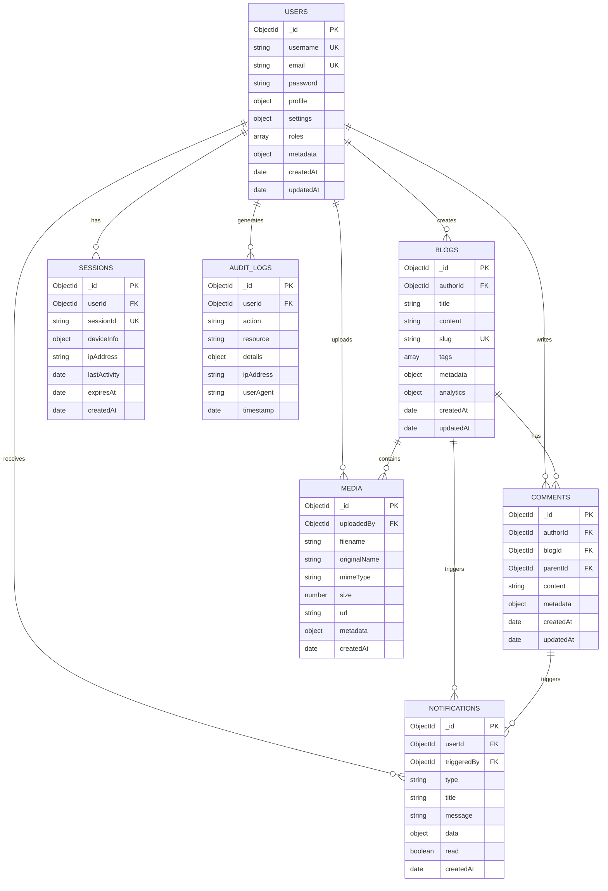

# 🗄️ Database Schema Documentation

**Social Media Blog Platform - Database Design & Schema**

_Version: 2.0.0 | Database: MongoDB 8.0+ | ODM: Mongoose 8.18+_

---

## 📋 Table of Contents

- [🎯 Overview](#-overview)
- [🏗️ Database Architecture](#️-database-architecture)
- [📊 Entity Relationship Diagram](#-entity-relationship-diagram)
- [📝 Collection Schemas](#-collection-schemas)
- [🔗 Relationships](#-relationships)
- [📈 Indexing Strategy](#-indexing-strategy)
- [🔒 Security & Validation](#-security--validation)
- [⚡ Performance Optimization](#-performance-optimization)
- [🔄 Migration Scripts](#-migration-scripts)

---

## 🎯 Overview

The Social Media Blog Platform uses MongoDB as the primary database with Mongoose ODM for schema definition and
validation. The database is designed for scalability, performance, and data integrity.

### Database Statistics

- **Collections**: 8 primary collections
- **Indexes**: 25+ optimized indexes
- **Relationships**: 15+ inter-collection relationships
- **Validation**: Comprehensive schema validation
- **Scalability**: Designed for horizontal scaling

---

## 🏗️ Database Architecture

### Database Design Principles

- **Document-Oriented**: Leveraging MongoDB's document structure
- **Denormalization**: Strategic denormalization for performance
- **Indexing**: Comprehensive indexing strategy
- **Validation**: Schema-level and application-level validation
- **Scalability**: Designed for sharding and replication

### Collection Overview

| Collection        | Purpose                          | Documents | Relationships                    |
| ----------------- | -------------------------------- | --------- | -------------------------------- |
| **users**         | User profiles and authentication | ~10K-1M   | → blogs, comments, notifications |
| **blogs**         | Blog posts and content           | ~50K-500K | → users, comments, media         |
| **comments**      | Blog post comments               | ~100K-1M  | → users, blogs                   |
| **notifications** | User notifications               | ~500K-5M  | → users                          |
| **media**         | File and image metadata          | ~20K-200K | → users, blogs                   |
| **sessions**      | User session data                | ~5K-50K   | → users                          |
| **audit_logs**    | System audit trails              | ~100K-1M  | → users                          |
| **system_config** | Application configuration        | ~100      | None                             |

---

## 📊 Entity Relationship Diagram



---

## 📝 Collection Schemas

### 👤 Users Collection

```javascript
const userSchema = new mongoose.Schema(
  {
    // Basic Information
    username: {
      type: String,
      required: true,
      unique: true,
      trim: true,
      minlength: 3,
      maxlength: 30,
      match: /^[a-zA-Z0-9_]+$/,
      index: true,
    },
    email: {
      type: String,
      required: true,
      unique: true,
      lowercase: true,
      trim: true,
      match: /^[^\s@]+@[^\s@]+\.[^\s@]+$/,
      index: true,
    },
    password: {
      type: String,
      required: true,
      minlength: 8,
      select: false, // Exclude from queries by default
    },

    // Profile Information
    profile: {
      firstName: {
        type: String,
        trim: true,
        maxlength: 50,
      },
      lastName: {
        type: String,
        trim: true,
        maxlength: 50,
      },
      bio: {
        type: String,
        maxlength: 500,
        trim: true,
      },
      avatar: {
        type: String,
        default: null,
      },
      coverImage: {
        type: String,
        default: null,
      },
      location: {
        type: String,
        maxlength: 100,
        trim: true,
      },
      website: {
        type: String,
        match: /^https?:\/\/.+/,
        maxlength: 200,
      },
      dateOfBirth: {
        type: Date,
        validate: {
          validator: function (v) {
            return v < new Date();
          },
          message: "Date of birth must be in the past",
        },
      },
    },

    // Settings & Preferences
    settings: {
      privacy: {
        profileVisibility: {
          type: String,
          enum: ["public", "friends", "private"],
          default: "public",
        },
        showEmail: {
          type: Boolean,
          default: false,
        },
        showLastSeen: {
          type: Boolean,
          default: true,
        },
      },
      notifications: {
        email: {
          type: Boolean,
          default: true,
        },
        push: {
          type: Boolean,
          default: true,
        },
        sms: {
          type: Boolean,
          default: false,
        },
        inApp: {
          type: Boolean,
          default: true,
        },
      },
      appearance: {
        theme: {
          type: String,
          enum: ["light", "dark", "auto"],
          default: "light",
        },
        language: {
          type: String,
          default: "en",
          match: /^[a-z]{2}$/,
        },
        timezone: {
          type: String,
          default: "UTC",
        },
      },
    },

    // Authorization & Security
    roles: [
      {
        type: String,
        enum: ["user", "admin", "super_admin"],
        default: "user",
      },
    ],
    permissions: [
      {
        type: String,
      },
    ],

    // Account Status
    status: {
      type: String,
      enum: ["active", "inactive", "suspended", "banned"],
      default: "active",
      index: true,
    },
    emailVerified: {
      type: Boolean,
      default: false,
      index: true,
    },
    emailVerificationToken: {
      type: String,
      select: false,
    },

    // Security
    passwordResetToken: {
      type: String,
      select: false,
    },
    passwordResetExpires: {
      type: Date,
      select: false,
    },
    loginAttempts: {
      type: Number,
      default: 0,
    },
    lockUntil: {
      type: Date,
    },

    // Social Features
    followers: [
      {
        type: mongoose.Schema.Types.ObjectId,
        ref: "User",
      },
    ],
    following: [
      {
        type: mongoose.Schema.Types.ObjectId,
        ref: "User",
      },
    ],
    blockedUsers: [
      {
        type: mongoose.Schema.Types.ObjectId,
        ref: "User",
      },
    ],

    // Metadata
    metadata: {
      lastLoginAt: {
        type: Date,
        index: true,
      },
      lastActiveAt: {
        type: Date,
        index: true,
      },
      loginCount: {
        type: Number,
        default: 0,
      },
      ipAddress: {
        type: String,
      },
      userAgent: {
        type: String,
      },
      registrationSource: {
        type: String,
        enum: ["web", "mobile", "api"],
        default: "web",
      },
    },
  },
  {
    timestamps: true,
    toJSON: { virtuals: true },
    toObject: { virtuals: true },
  },
);

// Indexes
userSchema.index({ email: 1, status: 1 });
userSchema.index({ username: 1, status: 1 });
userSchema.index({ "metadata.lastActiveAt": -1 });
userSchema.index({ createdAt: -1 });
userSchema.index({ roles: 1 });
```

### 📝 Blogs Collection

```javascript
const blogSchema = new mongoose.Schema(
  {
    // Basic Information
    title: {
      type: String,
      required: true,
      trim: true,
      minlength: 5,
      maxlength: 200,
      index: "text",
    },
    content: {
      type: String,
      required: true,
      minlength: 50,
      maxlength: 50000,
      index: "text",
    },
    excerpt: {
      type: String,
      maxlength: 500,
      trim: true,
    },
    slug: {
      type: String,
      required: true,
      unique: true,
      lowercase: true,
      trim: true,
      match: /^[a-z0-9-]+$/,
      index: true,
    },

    // Author Information
    author: {
      type: mongoose.Schema.Types.ObjectId,
      ref: "User",
      required: true,
      index: true,
    },

    // Content Organization
    tags: [
      {
        type: String,
        trim: true,
        lowercase: true,
        maxlength: 30,
      },
    ],
    categories: [
      {
        type: String,
        trim: true,
        maxlength: 50,
      },
    ],

    // Media & Assets
    featuredImage: {
      type: String,
      default: null,
    },
    images: [
      {
        type: mongoose.Schema.Types.ObjectId,
        ref: "Media",
      },
    ],
    attachments: [
      {
        type: mongoose.Schema.Types.ObjectId,
        ref: "Media",
      },
    ],

    // Publishing Status
    status: {
      type: String,
      enum: ["draft", "published", "archived", "deleted"],
      default: "draft",
      index: true,
    },
    visibility: {
      type: String,
      enum: ["public", "private", "unlisted"],
      default: "public",
      index: true,
    },
    publishedAt: {
      type: Date,
      index: true,
    },
    scheduledAt: {
      type: Date,
      index: true,
    },

    // SEO & Metadata
    seo: {
      metaTitle: {
        type: String,
        maxlength: 60,
      },
      metaDescription: {
        type: String,
        maxlength: 160,
      },
      keywords: [
        {
          type: String,
          maxlength: 50,
        },
      ],
      canonicalUrl: {
        type: String,
      },
    },

    // Analytics & Engagement
    analytics: {
      views: {
        type: Number,
        default: 0,
        index: true,
      },
      uniqueViews: {
        type: Number,
        default: 0,
      },
      likes: {
        type: Number,
        default: 0,
        index: true,
      },
      dislikes: {
        type: Number,
        default: 0,
      },
      shares: {
        type: Number,
        default: 0,
      },
      comments: {
        type: Number,
        default: 0,
        index: true,
      },
      readTime: {
        type: Number, // in minutes
        default: 0,
      },
      engagementScore: {
        type: Number,
        default: 0,
        index: true,
      },
    },

    // User Interactions
    likedBy: [
      {
        type: mongoose.Schema.Types.ObjectId,
        ref: "User",
      },
    ],
    dislikedBy: [
      {
        type: mongoose.Schema.Types.ObjectId,
        ref: "User",
      },
    ],
    bookmarkedBy: [
      {
        type: mongoose.Schema.Types.ObjectId,
        ref: "User",
      },
    ],

    // Content Settings
    settings: {
      allowComments: {
        type: Boolean,
        default: true,
      },
      allowLikes: {
        type: Boolean,
        default: true,
      },
      allowSharing: {
        type: Boolean,
        default: true,
      },
      moderateComments: {
        type: Boolean,
        default: false,
      },
    },

    // Version Control
    version: {
      type: Number,
      default: 1,
    },
    revisions: [
      {
        version: Number,
        title: String,
        content: String,
        modifiedBy: {
          type: mongoose.Schema.Types.ObjectId,
          ref: "User",
        },
        modifiedAt: {
          type: Date,
          default: Date.now,
        },
        changeLog: String,
      },
    ],
  },
  {
    timestamps: true,
    toJSON: { virtuals: true },
    toObject: { virtuals: true },
  },
);

// Indexes
blogSchema.index({ author: 1, status: 1 });
blogSchema.index({ status: 1, publishedAt: -1 });
blogSchema.index({ tags: 1, status: 1 });
blogSchema.index({ "analytics.views": -1 });
blogSchema.index({ "analytics.engagementScore": -1 });
blogSchema.index({ createdAt: -1 });
blogSchema.index({ title: "text", content: "text", tags: "text" });
```

### 💬 Comments Collection

```javascript
const commentSchema = new mongoose.Schema(
  {
    // Basic Information
    content: {
      type: String,
      required: true,
      trim: true,
      minlength: 1,
      maxlength: 2000,
    },

    // Relationships
    author: {
      type: mongoose.Schema.Types.ObjectId,
      ref: "User",
      required: true,
      index: true,
    },
    blog: {
      type: mongoose.Schema.Types.ObjectId,
      ref: "Blog",
      required: true,
      index: true,
    },
    parent: {
      type: mongoose.Schema.Types.ObjectId,
      ref: "Comment",
      default: null,
      index: true,
    },

    // Threading & Hierarchy
    level: {
      type: Number,
      default: 0,
      min: 0,
      max: 5, // Limit nesting depth
    },
    thread: {
      type: String,
      index: true,
    },

    // Status & Moderation
    status: {
      type: String,
      enum: ["published", "pending", "approved", "rejected", "deleted"],
      default: "published",
      index: true,
    },
    moderationReason: {
      type: String,
      maxlength: 200,
    },
    moderatedBy: {
      type: mongoose.Schema.Types.ObjectId,
      ref: "User",
    },
    moderatedAt: {
      type: Date,
    },

    // Engagement
    likes: {
      type: Number,
      default: 0,
      index: true,
    },
    dislikes: {
      type: Number,
      default: 0,
    },
    replies: {
      type: Number,
      default: 0,
    },

    // User Interactions
    likedBy: [
      {
        type: mongoose.Schema.Types.ObjectId,
        ref: "User",
      },
    ],
    dislikedBy: [
      {
        type: mongoose.Schema.Types.ObjectId,
        ref: "User",
      },
    ],

    // Metadata
    metadata: {
      ipAddress: String,
      userAgent: String,
      edited: {
        type: Boolean,
        default: false,
      },
      editedAt: Date,
      editHistory: [
        {
          content: String,
          editedAt: {
            type: Date,
            default: Date.now,
          },
        },
      ],
    },
  },
  {
    timestamps: true,
    toJSON: { virtuals: true },
    toObject: { virtuals: true },
  },
);

// Indexes
commentSchema.index({ blog: 1, status: 1, createdAt: -1 });
commentSchema.index({ author: 1, createdAt: -1 });
commentSchema.index({ parent: 1, createdAt: 1 });
commentSchema.index({ thread: 1, level: 1 });
```

### 🔔 Notifications Collection

```javascript
const notificationSchema = new mongoose.Schema(
  {
    // Recipient
    user: {
      type: mongoose.Schema.Types.ObjectId,
      ref: "User",
      required: true,
      index: true,
    },

    // Notification Details
    type: {
      type: String,
      required: true,
      enum: [
        "comment",
        "like",
        "follow",
        "mention",
        "blog_published",
        "blog_featured",
        "system_update",
        "security_alert",
        "admin_message",
        "welcome",
      ],
      index: true,
    },
    title: {
      type: String,
      required: true,
      maxlength: 100,
    },
    message: {
      type: String,
      required: true,
      maxlength: 500,
    },

    // Trigger Information
    triggeredBy: {
      type: mongoose.Schema.Types.ObjectId,
      ref: "User",
      index: true,
    },
    relatedResource: {
      resourceType: {
        type: String,
        enum: ["blog", "comment", "user", "system"],
      },
      resourceId: {
        type: mongoose.Schema.Types.ObjectId,
      },
    },

    // Status & Delivery
    status: {
      type: String,
      enum: ["pending", "sent", "delivered", "read", "failed"],
      default: "pending",
      index: true,
    },
    read: {
      type: Boolean,
      default: false,
      index: true,
    },
    readAt: {
      type: Date,
    },

    // Delivery Channels
    channels: {
      inApp: {
        sent: { type: Boolean, default: false },
        sentAt: Date,
      },
      email: {
        sent: { type: Boolean, default: false },
        sentAt: Date,
        emailId: String,
      },
      push: {
        sent: { type: Boolean, default: false },
        sentAt: Date,
        pushId: String,
      },
      sms: {
        sent: { type: Boolean, default: false },
        sentAt: Date,
        smsId: String,
      },
    },

    // Additional Data
    data: {
      type: mongoose.Schema.Types.Mixed,
      default: {},
    },

    // Priority & Scheduling
    priority: {
      type: String,
      enum: ["low", "normal", "high", "urgent"],
      default: "normal",
      index: true,
    },
    scheduledFor: {
      type: Date,
      index: true,
    },
    expiresAt: {
      type: Date,
      index: true,
    },
  },
  {
    timestamps: true,
  },
);

// Indexes
notificationSchema.index({ user: 1, read: 1, createdAt: -1 });
notificationSchema.index({ user: 1, type: 1 });
notificationSchema.index({ status: 1, scheduledFor: 1 });
notificationSchema.index({ expiresAt: 1 }, { expireAfterSeconds: 0 });
```

### 📁 Media Collection

```javascript
const mediaSchema = new mongoose.Schema(
  {
    // File Information
    filename: {
      type: String,
      required: true,
      unique: true,
    },
    originalName: {
      type: String,
      required: true,
    },
    mimeType: {
      type: String,
      required: true,
      index: true,
    },
    size: {
      type: Number,
      required: true,
      min: 0,
    },

    // Storage Information
    url: {
      type: String,
      required: true,
    },
    cloudinaryId: {
      type: String,
      unique: true,
      sparse: true,
    },
    path: {
      type: String,
    },

    // Upload Information
    uploadedBy: {
      type: mongoose.Schema.Types.ObjectId,
      ref: "User",
      required: true,
      index: true,
    },
    uploadSource: {
      type: String,
      enum: ["web", "mobile", "api"],
      default: "web",
    },

    // File Type & Category
    fileType: {
      type: String,
      enum: ["image", "video", "audio", "document", "other"],
      required: true,
      index: true,
    },
    category: {
      type: String,
      enum: ["avatar", "cover", "blog", "comment", "attachment"],
      index: true,
    },

    // Image-specific metadata
    imageMetadata: {
      width: Number,
      height: Number,
      format: String,
      colorSpace: String,
      hasAlpha: Boolean,
      variants: [
        {
          name: String, // thumbnail, medium, large
          url: String,
          width: Number,
          height: Number,
          size: Number,
        },
      ],
    },

    // Video-specific metadata
    videoMetadata: {
      duration: Number, // in seconds
      bitrate: Number,
      fps: Number,
      codec: String,
      resolution: String,
    },

    // Usage & References
    usedIn: [
      {
        resourceType: {
          type: String,
          enum: ["blog", "comment", "user_profile"],
        },
        resourceId: {
          type: mongoose.Schema.Types.ObjectId,
        },
      },
    ],
    usageCount: {
      type: Number,
      default: 0,
    },

    // Status & Moderation
    status: {
      type: String,
      enum: ["active", "deleted", "quarantined"],
      default: "active",
      index: true,
    },

    // Security & Validation
    checksum: {
      type: String,
      index: true,
    },
    virusScanResult: {
      status: {
        type: String,
        enum: ["pending", "clean", "infected", "error"],
      },
      scannedAt: Date,
      details: String,
    },

    // Metadata
    metadata: {
      alt: String,
      caption: String,
      tags: [String],
      exif: mongoose.Schema.Types.Mixed,
    },
  },
  {
    timestamps: true,
  },
);

// Indexes
mediaSchema.index({ uploadedBy: 1, createdAt: -1 });
mediaSchema.index({ fileType: 1, status: 1 });
mediaSchema.index({ checksum: 1 });
mediaSchema.index({ "usedIn.resourceType": 1, "usedIn.resourceId": 1 });
```

---

## 🔗 Relationships

### Primary Relationships

```javascript
// User → Blogs (One-to-Many)
User.hasMany(Blog, { foreignKey: "author" });
Blog.belongsTo(User, { foreignKey: "author" });

// Blog → Comments (One-to-Many)
Blog.hasMany(Comment, { foreignKey: "blog" });
Comment.belongsTo(Blog, { foreignKey: "blog" });

// User → Comments (One-to-Many)
User.hasMany(Comment, { foreignKey: "author" });
Comment.belongsTo(User, { foreignKey: "author" });

// Comment → Comment (Self-referencing for replies)
Comment.hasMany(Comment, { foreignKey: "parent" });
Comment.belongsTo(Comment, { foreignKey: "parent" });

// User → Notifications (One-to-Many)
User.hasMany(Notification, { foreignKey: "user" });
Notification.belongsTo(User, { foreignKey: "user" });

// User → Media (One-to-Many)
User.hasMany(Media, { foreignKey: "uploadedBy" });
Media.belongsTo(User, { foreignKey: "uploadedBy" });
```

### Virtual Relationships

```javascript
// User virtuals
userSchema.virtual("fullName").get(function () {
  return `${this.profile.firstName} ${this.profile.lastName}`.trim();
});

userSchema.virtual("isLocked").get(function () {
  return !!(this.lockUntil && this.lockUntil > Date.now());
});

userSchema.virtual("followersCount").get(function () {
  return this.followers.length;
});

userSchema.virtual("followingCount").get(function () {
  return this.following.length;
});

// Blog virtuals
blogSchema.virtual("isPublished").get(function () {
  return this.status === "published" && this.publishedAt <= new Date();
});

blogSchema.virtual("readTimeMinutes").get(function () {
  const wordsPerMinute = 200;
  const wordCount = this.content.split(/\s+/).length;
  return Math.ceil(wordCount / wordsPerMinute);
});

blogSchema.virtual("commentsCount", {
  ref: "Comment",
  localField: "_id",
  foreignField: "blog",
  count: true,
});

// Comment virtuals
commentSchema.virtual("hasReplies").get(function () {
  return this.replies > 0;
});

commentSchema.virtual("isEdited").get(function () {
  return this.metadata.edited;
});
```

---

## 📈 Indexing Strategy

### Performance Indexes

```javascript
// Users Collection Indexes
db.users.createIndex({ email: 1, status: 1 });
db.users.createIndex({ username: 1, status: 1 });
db.users.createIndex({ "metadata.lastActiveAt": -1 });
db.users.createIndex({ roles: 1 });
db.users.createIndex({ emailVerified: 1 });

// Blogs Collection Indexes
db.blogs.createIndex({ author: 1, status: 1 });
db.blogs.createIndex({ status: 1, publishedAt: -1 });
db.blogs.createIndex({ slug: 1 }, { unique: true });
db.blogs.createIndex({ tags: 1, status: 1 });
db.blogs.createIndex({ "analytics.views": -1 });
db.blogs.createIndex({ "analytics.engagementScore": -1 });

// Text Search Indexes
db.blogs.createIndex(
  {
    title: "text",
    content: "text",
    tags: "text",
  },
  {
    weights: {
      title: 10,
      tags: 5,
      content: 1,
    },
  },
);

// Comments Collection Indexes
db.comments.createIndex({ blog: 1, status: 1, createdAt: -1 });
db.comments.createIndex({ author: 1, createdAt: -1 });
db.comments.createIndex({ parent: 1, createdAt: 1 });

// Notifications Collection Indexes
db.notifications.createIndex({ user: 1, read: 1, createdAt: -1 });
db.notifications.createIndex({ user: 1, type: 1 });
db.notifications.createIndex({ status: 1, scheduledFor: 1 });

// TTL Index for expired notifications
db.notifications.createIndex({ expiresAt: 1 }, { expireAfterSeconds: 0 });

// Media Collection Indexes
db.media.createIndex({ uploadedBy: 1, createdAt: -1 });
db.media.createIndex({ fileType: 1, status: 1 });
db.media.createIndex({ checksum: 1 });
```

### Compound Indexes for Complex Queries

```javascript
// Blog discovery and filtering
db.blogs.createIndex({
  status: 1,
  visibility: 1,
  publishedAt: -1,
});

// User activity tracking
db.users.createIndex({
  status: 1,
  "metadata.lastActiveAt": -1,
});

// Comment threading
db.comments.createIndex({
  blog: 1,
  parent: 1,
  createdAt: 1,
});

// Notification delivery
db.notifications.createIndex({
  status: 1,
  priority: 1,
  scheduledFor: 1,
});
```

---

## 🔒 Security & Validation

### Schema-Level Validation

```javascript
// Password strength validation
const passwordValidator = {
  validator: function (password) {
    // At least 8 characters, 1 uppercase, 1 lowercase, 1 number
    return /^(?=.*[a-z])(?=.*[A-Z])(?=.*\d)[a-zA-Z\d@$!%*?&]{8,}$/.test(password);
  },
  message: "Password must be at least 8 characters with uppercase, lowercase, and number",
};

// Email validation
const emailValidator = {
  validator: function (email) {
    return /^[^\s@]+@[^\s@]+\.[^\s@]+$/.test(email);
  },
  message: "Please provide a valid email address",
};

// URL validation
const urlValidator = {
  validator: function (url) {
    return /^https?:\/\/.+/.test(url);
  },
  message: "Please provide a valid URL starting with http:// or https://",
};
```

### Data Sanitization

```javascript
// Pre-save middleware for data sanitization
userSchema.pre("save", function (next) {
  // Sanitize user input
  if (this.profile.bio) {
    this.profile.bio = this.profile.bio.replace(/<script\b[^<]*(?:(?!<\/script>)<[^<]*)*<\/script>/gi, "");
  }

  // Normalize email
  if (this.email) {
    this.email = this.email.toLowerCase().trim();
  }

  // Generate username slug
  if (this.username) {
    this.username = this.username.toLowerCase().replace(/[^a-z0-9_]/g, "");
  }

  next();
});

blogSchema.pre("save", function (next) {
  // Generate slug from title
  if (this.title && (!this.slug || this.isModified("title"))) {
    this.slug = this.title
      .toLowerCase()
      .replace(/[^a-z0-9\s-]/g, "")
      .replace(/\s+/g, "-")
      .replace(/-+/g, "-")
      .trim("-");
  }

  // Calculate read time
  if (this.content) {
    const wordCount = this.content.split(/\s+/).length;
    this.analytics.readTime = Math.ceil(wordCount / 200);
  }

  next();
});
```

---

## ⚡ Performance Optimization

### Query Optimization Patterns

```javascript
// Efficient user lookup with selected fields
const findUserById = id => {
  return User.findById(id).select("username email profile.firstName profile.lastName profile.avatar").lean(); // Returns plain JavaScript object for better performance
};

// Paginated blog listing with population
const getBlogsPaginated = (page = 1, limit = 10) => {
  return Blog.find({ status: "published", visibility: "public" })
    .populate("author", "username profile.firstName profile.lastName profile.avatar")
    .select("title excerpt slug featuredImage analytics.views analytics.likes createdAt")
    .sort({ publishedAt: -1 })
    .skip((page - 1) * limit)
    .limit(limit)
    .lean();
};

// Efficient comment threading
const getCommentThread = (blogId, parentId = null) => {
  return Comment.find({
    blog: blogId,
    parent: parentId,
    status: "published",
  })
    .populate("author", "username profile.firstName profile.lastName profile.avatar")
    .sort({ createdAt: 1 })
    .lean();
};
```

### Aggregation Pipelines

```javascript
// Blog analytics aggregation
const getBlogAnalytics = authorId => {
  return Blog.aggregate([
    { $match: { author: ObjectId(authorId) } },
    {
      $group: {
        _id: null,
        totalBlogs: { $sum: 1 },
        totalViews: { $sum: "$analytics.views" },
        totalLikes: { $sum: "$analytics.likes" },
        totalComments: { $sum: "$analytics.comments" },
        avgEngagement: { $avg: "$analytics.engagementScore" },
      },
    },
  ]);
};

// User engagement metrics
const getUserEngagementMetrics = userId => {
  return User.aggregate([
    { $match: { _id: ObjectId(userId) } },
    {
      $lookup: {
        from: "blogs",
        localField: "_id",
        foreignField: "author",
        as: "blogs",
      },
    },
    {
      $lookup: {
        from: "comments",
        localField: "_id",
        foreignField: "author",
        as: "comments",
      },
    },
    {
      $project: {
        username: 1,
        blogCount: { $size: "$blogs" },
        commentCount: { $size: "$comments" },
        totalViews: { $sum: "$blogs.analytics.views" },
        totalLikes: { $sum: "$blogs.analytics.likes" },
      },
    },
  ]);
};
```

---

## 🔄 Migration Scripts

### Database Migration Framework

```javascript
// migrations/001_create_indexes.js
export const up = async db => {
  // Create essential indexes
  await db.collection("users").createIndex({ email: 1 }, { unique: true });
  await db.collection("users").createIndex({ username: 1 }, { unique: true });
  await db.collection("blogs").createIndex({ slug: 1 }, { unique: true });
  await db.collection("blogs").createIndex({ author: 1, status: 1 });

  console.log("✅ Indexes created successfully");
};

export const down = async db => {
  // Drop indexes if needed
  await db.collection("users").dropIndex({ email: 1 });
  await db.collection("users").dropIndex({ username: 1 });
  await db.collection("blogs").dropIndex({ slug: 1 });
  await db.collection("blogs").dropIndex({ author: 1, status: 1 });

  console.log("✅ Indexes dropped successfully");
};

// migrations/002_add_analytics_fields.js
export const up = async db => {
  // Add analytics fields to existing blogs
  await db.collection("blogs").updateMany(
    { analytics: { $exists: false } },
    {
      $set: {
        analytics: {
          views: 0,
          uniqueViews: 0,
          likes: 0,
          dislikes: 0,
          shares: 0,
          comments: 0,
          readTime: 0,
          engagementScore: 0,
        },
      },
    },
  );

  console.log("✅ Analytics fields added to blogs");
};

// migrations/003_user_settings_migration.js
export const up = async db => {
  // Add default settings to existing users
  await db.collection("users").updateMany(
    { settings: { $exists: false } },
    {
      $set: {
        settings: {
          privacy: {
            profileVisibility: "public",
            showEmail: false,
            showLastSeen: true,
          },
          notifications: {
            email: true,
            push: true,
            sms: false,
            inApp: true,
          },
          appearance: {
            theme: "light",
            language: "en",
            timezone: "UTC",
          },
        },
      },
    },
  );

  console.log("✅ User settings migration completed");
};
```

### Data Seeding Scripts

```javascript
// seeds/admin_user.js
export const seedAdminUser = async () => {
  const adminExists = await User.findOne({ roles: "super_admin" });

  if (!adminExists) {
    const adminUser = new User({
      username: "admin",
      email: "admin@socialmedia.com",
      password: await bcrypt.hash("AdminPassword123!", 12),
      roles: ["super_admin"],
      emailVerified: true,
      profile: {
        firstName: "System",
        lastName: "Administrator",
      },
      status: "active",
    });

    await adminUser.save();
    console.log("✅ Admin user created");
  }
};

// seeds/sample_data.js
export const seedSampleData = async () => {
  // Create sample users
  const sampleUsers = [
    {
      username: "johndoe",
      email: "john@example.com",
      password: await bcrypt.hash("Password123!", 12),
      profile: { firstName: "John", lastName: "Doe" },
      emailVerified: true,
    },
    {
      username: "janedoe",
      email: "jane@example.com",
      password: await bcrypt.hash("Password123!", 12),
      profile: { firstName: "Jane", lastName: "Doe" },
      emailVerified: true,
    },
  ];

  const users = await User.insertMany(sampleUsers);

  // Create sample blogs
  const sampleBlogs = [
    {
      title: "Welcome to Our Platform",
      content: "This is a sample blog post to demonstrate the platform features...",
      slug: "welcome-to-our-platform",
      author: users[0]._id,
      status: "published",
      publishedAt: new Date(),
    },
  ];

  await Blog.insertMany(sampleBlogs);
  console.log("✅ Sample data created");
};
```

---

## 📊 Database Monitoring

### Performance Monitoring Queries

```javascript
// Monitor slow queries
db.setProfilingLevel(2, { slowms: 100 });

// Check index usage
db.blogs.aggregate([{ $indexStats: {} }]);

// Monitor collection statistics
db.runCommand({ collStats: "users" });
db.runCommand({ collStats: "blogs" });
db.runCommand({ collStats: "comments" });

// Check database size
db.stats();

// Monitor active connections
db.serverStatus().connections;
```

### Health Check Queries

```javascript
// Database health check
export const checkDatabaseHealth = async () => {
  try {
    // Check connection
    await mongoose.connection.db.admin().ping();

    // Check collection counts
    const stats = {
      users: await User.countDocuments(),
      blogs: await Blog.countDocuments(),
      comments: await Comment.countDocuments(),
      notifications: await Notification.countDocuments(),
      media: await Media.countDocuments(),
    };

    // Check index health
    const indexStats = await Blog.collection.indexStats();

    return {
      status: "healthy",
      collections: stats,
      indexes: indexStats.length,
      timestamp: new Date(),
    };
  } catch (error) {
    return {
      status: "unhealthy",
      error: error.message,
      timestamp: new Date(),
    };
  }
};
```

---

## 🔧 Maintenance Scripts

### Cleanup Scripts

```javascript
// Clean up expired notifications
export const cleanupExpiredNotifications = async () => {
  const result = await Notification.deleteMany({
    expiresAt: { $lt: new Date() },
  });

  console.log(`🧹 Cleaned up ${result.deletedCount} expired notifications`);
};

// Clean up unused media files
export const cleanupUnusedMedia = async () => {
  const unusedMedia = await Media.find({
    usageCount: 0,
    createdAt: { $lt: new Date(Date.now() - 30 * 24 * 60 * 60 * 1000) }, // 30 days old
  });

  for (const media of unusedMedia) {
    // Delete from cloud storage
    if (media.cloudinaryId) {
      await cloudinary.uploader.destroy(media.cloudinaryId);
    }

    // Delete from database
    await media.deleteOne();
  }

  console.log(`🧹 Cleaned up ${unusedMedia.length} unused media files`);
};

// Archive old audit logs
export const archiveOldAuditLogs = async () => {
  const sixMonthsAgo = new Date(Date.now() - 6 * 30 * 24 * 60 * 60 * 1000);

  const result = await AuditLog.deleteMany({
    timestamp: { $lt: sixMonthsAgo },
  });

  console.log(`📦 Archived ${result.deletedCount} old audit logs`);
};
```

---

## 📋 Best Practices

### Schema Design Best Practices

1. **Use appropriate data types** for optimal storage and performance
2. **Implement proper validation** at schema level
3. **Create strategic indexes** for query optimization
4. **Use virtual fields** for computed properties
5. **Implement soft deletes** for important data
6. **Use TTL indexes** for temporary data
7. **Normalize when necessary** but embrace denormalization for performance
8. **Implement proper error handling** in middleware

### Query Optimization Best Practices

1. **Use lean() queries** when you don't need Mongoose documents
2. **Select only required fields** to reduce data transfer
3. **Use aggregation pipelines** for complex data processing
4. **Implement proper pagination** for large datasets
5. **Use indexes effectively** for query performance
6. **Monitor slow queries** and optimize them
7. **Use connection pooling** for better resource management
8. **Implement query result caching** for frequently accessed data

---

**Database Schema Documentation v2.0.0**

_Last Updated: January 2025 | Next Review: Q2 2025_

_This documentation is maintained by the development team and updated with each schema change._
